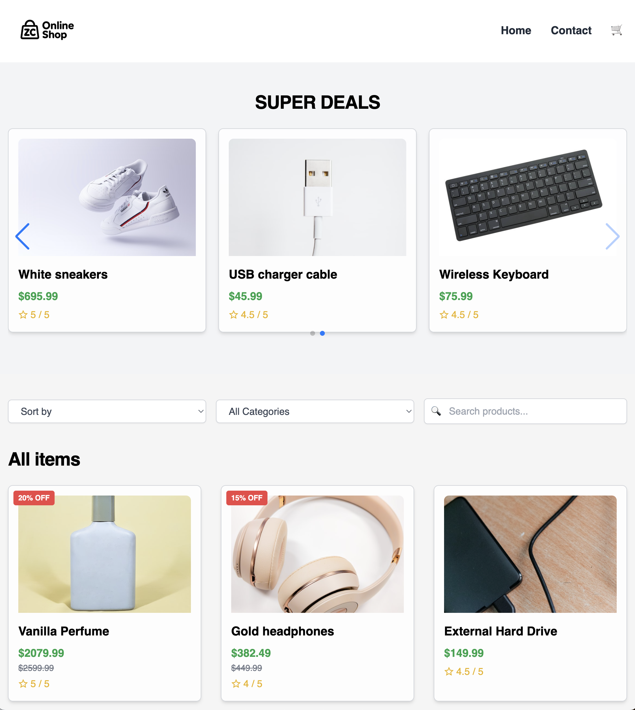
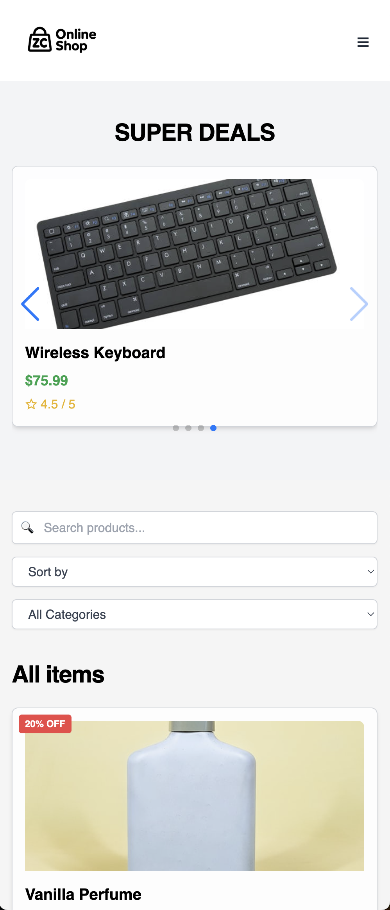

# ZeeCo – E-Commerce Store




## Overview

ZeeCo is a fully functional and responsive online store built with **React**, **Vite**, **TypeScript**, **Zustand**, and **Tailwind CSS**. It allows users to browse products, manage their cart, complete a checkout process, and get in touch through a contact form. Product data is fetched from the **Noroff API**, and the layout is designed to work well across all screen sizes.

> 🔗 Live site: [https://zico-jsfw.netlify.app](https://zico-jsfw.netlify.app)

---

## Key Features

* **Homepage**: Browse all products, with search, sorting, and category filters.
* **Product Page**: Detailed info including image, description, price, and reviews.
* **Cart Page**: Add, remove, and adjust quantities. See total cost.
* **Checkout Success Page**: Order confirmation and cart reset.
* **Contact Page**: Validated form to send a message.
* **Responsive Design**: Works on all screen sizes.

---

## Technologies Used

* **React** – UI library
* **Vite** – Frontend build tool
* **TypeScript** – Type-safe JavaScript
* **Zustand** – State management (cart state)
* **Tailwind CSS** – Utility-first styling
* **React Router** – Client-side routing

---

## API

All product data comes from:

```
https://v2.api.noroff.dev/online-shop
```

You can fetch individual products by appending `/:id`.

---

## Pages

### Homepage

* Product grid
* Search bar
* Sort by price/name
* Filter by category

### Product Page

* Title, image, price, description
* Add to Cart button

### Cart Page

* All cart items
* Quantity adjust, remove, total calculation
* Checkout button

### Checkout Success

* Success message and cart reset
* Link back to homepage

### Contact

* Form with:

  * Full Name
  * Subject
  * Email
  * Message
* Validation and toast notification

---

## Installation

To run locally:

```bash
git clone https://github.com/NoroffFEU/jsfw-2025-v1-nstr.git
cd jsfw-2025-v1-nstr
npm install
npm run dev
```

Then visit [http://localhost:5173](http://localhost:5173)

---

## State Management

This project uses **Zustand** for:

* Managing cart state (add, remove, quantity)
* Persisting data in localStorage

---

## Deployment

Deployed on **Netlify**:
🔗 [https://zico-jsfw.netlify.app](https://zico-jsfw.netlify.app)

> ⚠️ Note: A `_redirects` file is included in `/public` to support React Router navigation.

---

## Conclusion

This project was built as part of a JavaScript Frameworks course assignment. It demonstrates how to build a complete e-commerce frontend using modern tools like React, Zustand, and Tailwind — with clean code, responsive layout, and API integration.
